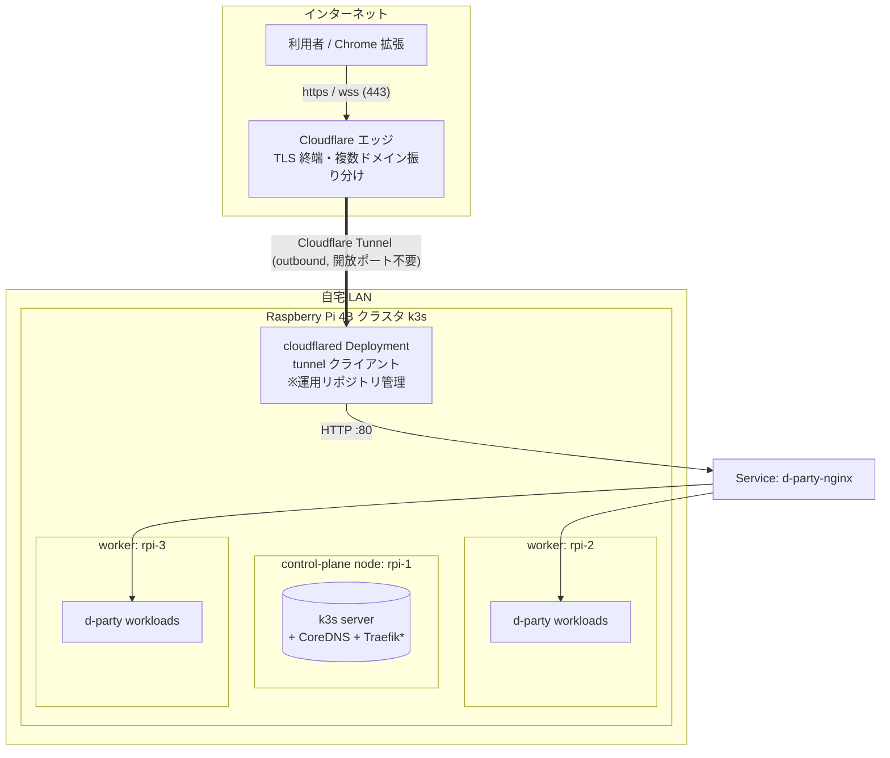
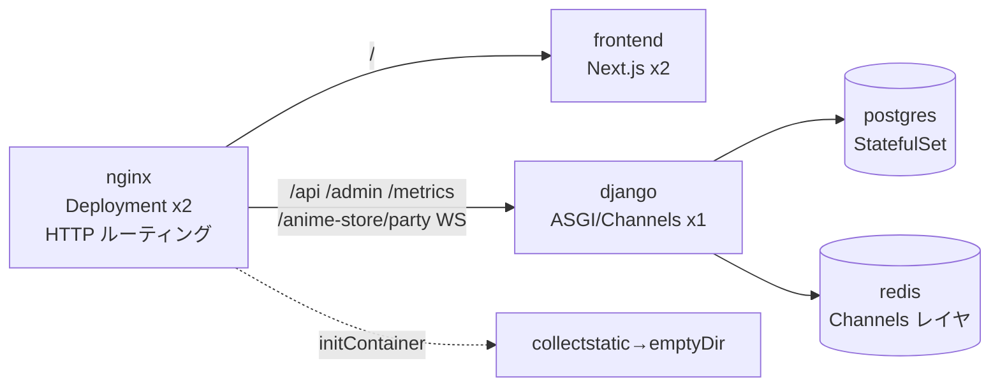
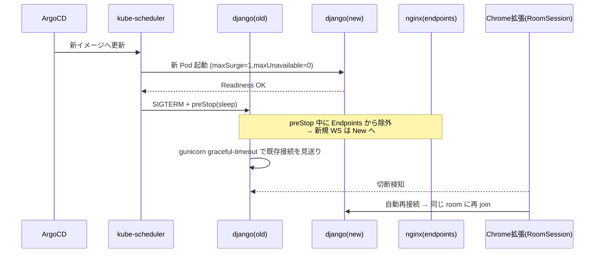
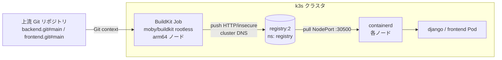
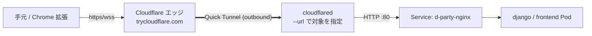

# deploy/ — k3s (Raspberry Pi 4B) 向けデプロイ

このディレクトリは、d-party の **サーバ実行部分（nginx 以降）** を Raspberry Pi 4B で
組んだ **k3s クラスタ**へデプロイするための設定です。

設計方針（重要）:

- このリポジトリが持つのは **d-party アプリ単体のクラスタ設定**です（Helm chart 1 本）。
  d-party は自分専用の postgres / redis を chart に同梱し、**他サービスとは共有しません**
  （別サービスが DB/Redis を要るなら、そのサービス側で別途立てる）。
- **ドメイン解決と TLS は Cloudflare Tunnel（cloudflared）がエッジで終端**します。
  cloudflared は各サービスの `nginx` Service をホスト名で振り分けるため、**同じ端末で
  d-party 以外のサービスも同居**できます（マルチテナント）。cloudflared 本体・ドメイン
  割り当て・Argo CD 本体の導入は **別の「クラスタ運用リポジトリ」**で扱います（後述）。
- **クラスタ共有の基盤（ローカルレジストリ＋ノードの containerd 設定）は
  [`platform/`](platform/README.md) に分離**しています。これは d-party 専用ではなく、
  同居する他サービスからも共用される singleton です（理想は別リポジトリへ切り出し）。
- DB/Redis は **NetworkPolicy で同 release 内からのみ到達可能**にし、stateful には
  **PriorityClass** を当てて、同居サービスのメモリ逼迫時にも DB が evict されにくくします。
- WebSocket を切らさないために **グレースフルなローリング更新**を前提に組んでいます。
- **CD は Argo CD（GitOps）**。運用リポジトリの `Application` がこの chart を参照します。

```
deploy/
  helm/d-party/              ← d-party 単体の Helm chart（このリポジトリの本体）
    Chart.yaml values.yaml
    templates/               nginx · django · frontend · postgres · redis · migrate(hook)
                             · networkpolicy · priorityclass · ingress(任意)
  platform/                  ← クラスタ共有の基盤（d-party 専用ではない。詳細は platform/README.md）
    registry.yaml            ← クラスタ内ローカルレジストリ（registry:2）＋ NodePort
    k3s-registries.yaml      ← ノードの /etc/rancher/k3s/registries.yaml スニペット
  build/
    buildkit-backend-job.yaml   ← d-party 固有: backend を共有レジストリへ push する Job
    buildkit-frontend-job.yaml  ← d-party 固有: frontend を共有レジストリへ push する Job
  argocd/
    application.example.yaml ← CD の入口サンプル（実体は運用リポジトリへ）
  README.md                  ← 本書
```

---

## 1. Raspberry Pi クラスタ構成図

### 物理／ネットワーク



ポイント:

- **インバウンドのポート開放は不要**。cloudflared が Cloudflare へ *outbound* で
  トンネルを張るため、ルータのポートフォワードや固定 IP が要りません。
- TLS とドメイン（複数ドメイン含む）の振り分けは **Cloudflare 側**で完結します。
  クラスタ内は HTTP のみ。だから本 chart の nginx は **TLS 終端をやめて HTTP ルーティング専用**
  にしています（既存の `/api` `/admin` `/anime-store/party/` 振り分け・CORS・static 配信は流用）。
- `*` Traefik は k3s 同梱ですが、cloudflared を使う限り必須ではありません。

### 推奨ハードウェア／OS

| 項目 | 推奨 |
|---|---|
| ノード | Raspberry Pi 4B（4GB 以上、できれば 8GB）×3（1 control-plane + 2 worker） |
| ストレージ | **USB3 接続 SSD**（microSD は DB の書き込みで寿命が尽きるため非推奨） |
| OS | Raspberry Pi OS Lite (64-bit) もしくは Ubuntu Server 24.04 (arm64) |
| カーネル | cgroup v2 有効（`cgroup_enable=memory cgroup_memory=1` を `cmdline.txt` に） |

### クラスタ内コンポーネント（この chart が作るもの）



- **postgres / redis は公式イメージ（`postgres:16` / `redis:7.4`）+ 自前 StatefulSet**。
  > Bitnami の Helm chart は採用しません。Bitnami は 2025-08〜09 で公開カタログ
  > (`docker.io/bitnami`) を Legacy 化／削除し、無償の versioned イメージが
  > 廃止されました（出典: bitnami/charts#35164）。公式イメージなら ARM64 提供・
  > 継続メンテが確実です。
- static は **nginx Pod の initContainer**（backend イメージ）で `collectstatic` し、
  同 Pod の emptyDir 経由で配信（クロス Pod のボリューム共有を避ける）。

---

## 2. グレースフル更新（WebSocket を切らさない）

同時視聴の WebSocket セッション状態は **Django プロセス内**に保持されます
（`streamer/consumers.py`。room/user の生死は Redis ではなくプロセスが持つ）。
そのため更新時は「新 Pod を先に Ready にしてから旧 Pod を見送る」方式を取ります。



実装上の効かせどころ（`values.yaml`）:

| 仕組み | 設定 | 既定 |
|---|---|---|
| 先出し起動 | `*.strategy.maxSurge=1` / `maxUnavailable=0` | 有効 |
| 終了猶予 | `django.terminationGracePeriodSeconds` | 120s |
| Endpoints 除外の伝播待ち | `django.preStopSleepSeconds` | 5s |
| gunicorn graceful | `django.gunicornGracefulTimeout`（`GUNICORN_CMD_ARGS` で注入） | 110s |
| nginx graceful | preStop `nginx -s quit` + `nginx.terminationGracePeriodSeconds` | 60s |
| WS 長時間タイムアウト | nginx `proxy_read/send_timeout 3600s` | 有効 |

> **注意（django は replicas=1 固定）**：`close_active_sessions` が起動時に
> 「全 alive 行」を論理削除する設計のため、django を 2 つ以上に増やすと、起動した
> 片方がもう片方の生きたセッション統計を消します。スケールが必要になったら
> backend 側でセッション状態を Redis 等に外出しする改修が前提です（本 chart の範囲外）。
> 現状は「新旧 1 個ずつの短時間並走 → 利用者は再接続で復帰」で運用します。

---

## 3. デプロイ方法

### 3.1 前提（クラスタ運用リポジトリ側・本リポジトリ外）

1. **k3s** を 3 台へ導入（control-plane 1 + worker 2）。
2. **Argo CD** をクラスタへインストール（GitOps の中枢。CNCF Graduated）。
3. **cloudflared** を Deployment で常駐させ、Cloudflare Tunnel を
   `Service: d-party-nginx:80` に向ける。複数ドメイン／他サービスの振り分けは
   cloudflared の ingress 定義（運用リポジトリ）で行う。
4. **機微情報**は SealedSecrets か SOPS で暗号化し、`d-party-secret`（`SECRET_KEY` /
   `POSTGRES_PASSWORD` を含む）として用意。

### 3.2 イメージビルド（クラスタ内ビルド + ローカルレジストリ）

backend / frontend イメージは **クラスタ内で ARM64 ネイティブにビルド**し、
**クラスタ内ローカルレジストリ**へ push します（QEMU/クロスビルド不要、外部レジストリ不要）。



イメージ名は全体で `registry.registry.svc.cluster.local:5000/<name>` に統一します。

- **push 側（クラスタ内）**: BuildKit Job は Pod なので cluster DNS を解決でき、Service の
  ClusterIP へ直接 push します（HTTP / `registry.insecure=true`）。
- **pull 側（ノード containerd）**: ノードは cluster DNS を解決できないため、
  `registries.yaml` で同じイメージ名を NodePort（`http://127.0.0.1:30500`）へミラーします。

#### 手順

```bash
# 1) 共有レジストリを 1 回だけ用意（クラスタ共有基盤。詳細は deploy/platform/README.md）
kubectl apply -f deploy/platform/registry.yaml

# 2) 全ノードに registries.yaml を配置して k3s を再起動（1 回だけ）
sudo cp deploy/platform/k3s-registries.yaml /etc/rancher/k3s/registries.yaml
sudo systemctl restart k3s          # server ノード
sudo systemctl restart k3s-agent    # agent(worker) ノード

# 3) イメージをビルド＆push（リリースのたびに実行。新しい Job が毎回作られる）
kubectl create -f deploy/build/buildkit-backend-job.yaml
kubectl create -f deploy/build/buildkit-frontend-job.yaml
kubectl -n registry get jobs -w
```

> **frontend の build-arg**: `NEXT_PUBLIC_*` はビルド時に焼き込まれます。
> `deploy/build/buildkit-frontend-job.yaml` の `build-arg:NEXT_PUBLIC_BACKEND_HOST` 等を
> 公開ドメイン（`docker-compose.prod.yml` と同じ値）に合わせて編集してください。

> **ノード前提（rootless ビルド）**: rootless BuildKit は user namespace を使います。
> Ubuntu 24.04 (arm64) では以下をノードで有効化してください。
> ```bash
> sudo sysctl -w kernel.apparmor_restrict_unprivileged_userns=0
> sudo sysctl -w user.max_user_namespaces=28633   # 0 の場合のみ
> ```
> （恒久化は `/etc/sysctl.d/` に記載）。Raspberry Pi OS では既定で利用可能なことが多いです。

chart の既定 image 参照（`values.django.image` / `values.frontend.image`）は
このローカルレジストリ（`registry.registry.svc.cluster.local:5000/...`、`pullPolicy: Always`）
に設定済みです。GHCR 等の外部レジストリを使う場合は values で上書きしてください。

### 3.3 CD（Argo CD / GitOps）

`deploy/argocd/application.example.yaml` を雛形に、運用リポジトリへ `Application` を置きます。

```bash
kubectl apply -n argocd -f deploy/argocd/application.example.yaml
```

- `source.path = deploy/helm/d-party` を指し、`config.MY_DOMAIN` と
  `secret.existingSecret` を values 上書きで注入。
- `syncPolicy.automated`（prune + selfHeal）で Git を真実として自動同期。
- イメージ tag の自動追従が必要なら **argocd-image-updater**（active maintained,
  v1.2.x）を導入し、example の annotations で semver 追従させます。

### 3.4 手元での検証（helm 単体）

```bash
# 構文・テンプレート検証（クラスタ不要）
helm lint   deploy/helm/d-party
helm template d-party deploy/helm/d-party | less

# クラスタへ直接入れる場合（GitOps を使わない暫定確認）
helm upgrade --install d-party deploy/helm/d-party \
  -n d-party --create-namespace \
  --set config.MY_DOMAIN=d-party.example \
  --set secret.existingSecret=d-party-secret
```

マイグレーションは Helm hook Job（`pre-install`/`pre-upgrade`）で 1 回だけ自動実行されます。

### 3.5 動作確認

```bash
kubectl -n d-party get pods,svc
kubectl -n d-party port-forward svc/d-party-nginx 8080:80
# http://localhost:8080/         フロント
# http://localhost:8080/api/...  REST API
```

---

## 4. 採用コンポーネントとメンテ状況（デファクト確認）

| 用途 | 採用 | デファクト／メンテ状況 |
|---|---|---|
| K8s ディストロ | **k3s** | RPi 定番。CNCF 配下（SUSE/Rancher）、活発 |
| GitOps/CD | **Argo CD** | CNCF *Graduated*、活発 |
| イメージ tag 自動更新（任意） | **argocd-image-updater** | argoproj-labs、v1.2.x 継続リリース |
| 公開／トンネル | **Cloudflare Tunnel (cloudflared)** | Cloudflare 公式、活発 |
| クラスタ内ビルド | **moby/buildkit（rootless）** | Moby/CNCF 系、活発。daemonless で K8s Job 向き |
| ローカルレジストリ | **registry:2（CNCF Distribution）** | CNCF プロジェクト、ARM64 提供、業界標準 |
| DB | **postgres:16（公式）** | Docker 公式、ARM64 提供、長期メンテ |
| キャッシュ/レイヤ | **redis:7.4（公式）** | Docker 公式、ARM64 提供 |
| リバースプロキシ | **nginx:1.27（公式）** | Docker 公式 |
| 永続化 | **local-path-provisioner** | k3s 同梱の既定 StorageClass |
| 機微情報 | **SealedSecrets / SOPS**（運用リポジトリ） | 業界標準。Sealed Secrets は Bitnami の方針変更の影響を受けない |

> Bitnami の Helm chart（postgresql/redis 等）は 2025 年のカタログ廃止により
> **意図的に不採用**。公式イメージ + 自前 StatefulSet で代替しています。

---

## 5. Cloudflare Quick Tunnel での検証

Pi 実機や独自ドメインが無くても、**Cloudflare アカウント不要**の
[Quick Tunnel](https://developers.cloudflare.com/cloudflare-one/connections/connect-networks/do-more-with-tunnels/trycloudflare/)
（`cloudflared tunnel --url ...`）で、`https://<random>.trycloudflare.com` を即時発行して
クラスタを外部公開できます。**HTTP/WebSocket とも通る**ので、グレースフル更新や Chrome 拡張
からの接続まで end-to-end で確認できます。

> Quick Tunnel は **検証専用**です（URL がプロセス再起動のたびに変わる／無認証／レート制限）。
> 本番運用では Section 3.1 の Named Tunnel（`cloudflared tunnel create` + DNS route）に切り替えます。

### 5.1 検証フロー



### 5.2 事前準備（共通）

任意のクラスタ（dev container 上の k3d / minikube、または Pi 実機 k3s）に chart を入れます。

```bash
# クラスタ未構築なら k3d で（dev container でも可）
k3d cluster create d-party --agents 2 \
  --port "80:80@loadbalancer" --port "443:443@loadbalancer"

# d-party Secret（検証用なので平文。本番は SealedSecrets/SOPS）
kubectl create ns d-party
kubectl -n d-party create secret generic d-party-secret \
  --from-literal=SECRET_KEY=dev-only-change-me \
  --from-literal=POSTGRES_PASSWORD=dev-only-change-me

# chart を入れる（Quick Tunnel で外から触るので MY_DOMAIN は仮で OK）
helm upgrade --install d-party deploy/helm/d-party \
  -n d-party --create-namespace \
  --set config.MY_DOMAIN=quicktunnel.local \
  --set secret.existingSecret=d-party-secret

kubectl -n d-party rollout status deploy/d-party-nginx
kubectl -n d-party rollout status deploy/d-party-django
```

### 5.3 方法 A: 手元（dev container）から cloudflared を起動【最速】

`cloudflared` は **Dev Container Feature**
（[`ghcr.io/devcontainers-extra/features/cloudflared`](https://github.com/devcontainers-extra/features/tree/main/src/cloudflared)）
で dev container に同梱済みです（`.devcontainer/devcontainer.json` の `features` を参照）。
初回ビルド後は `cloudflared --version` がそのまま使えます。

```bash
cloudflared --version       # Feature により事前インストール済み

# 1) nginx Service を手元へ port-forward（別ターミナル）
kubectl -n d-party port-forward svc/d-party-nginx 8080:80

# 2) Quick Tunnel を起動（さらに別ターミナル）
cloudflared tunnel --url http://localhost:8080
# → 標準出力に「Your quick Tunnel has been created ...
#   https://<random-words>.trycloudflare.com」が表示される
```

> dev container を作り直していない既存環境では、コンテナをリビルド（VS Code の
> `Dev Containers: Rebuild Container`）すると Feature が適用されて `cloudflared` が入ります。
> 手動で入れたい場合のみ、Feature を使わずに `curl -L ... -o /usr/local/bin/cloudflared`
> でも代替可能です。


### 5.4 方法 B: cloudflared を Pod としてクラスタ内に置く【Pi 実機に近い】

`kubectl logs` で URL を回収します。マニフェストは ephemeral 用なので inline で十分です。

```bash
cat <<'EOF' | kubectl apply -f -
apiVersion: v1
kind: Namespace
metadata: { name: cloudflared-quick }
---
apiVersion: apps/v1
kind: Deployment
metadata:
  name: cloudflared-quick
  namespace: cloudflared-quick
spec:
  replicas: 1
  selector: { matchLabels: { app: cloudflared-quick } }
  template:
    metadata: { labels: { app: cloudflared-quick } }
    spec:
      containers:
        - name: cloudflared
          image: cloudflare/cloudflared:latest
          args:
            - tunnel
            - --no-autoupdate
            - --url
            - http://d-party-nginx.d-party.svc.cluster.local:80
          resources:
            requests: { cpu: "50m",  memory: "64Mi" }
            limits:   { cpu: "200m", memory: "128Mi" }
EOF

# URL の取り出し（プロセス起動から 5〜10 秒後）
kubectl -n cloudflared-quick logs -l app=cloudflared-quick -f \
  | grep -Eo 'https://[a-z0-9-]+\.trycloudflare\.com' | head -1
```

### 5.5 動作確認シナリオ

`URL=https://<random>.trycloudflare.com` を控えて以下を実施します。

```bash
URL=https://<出力された URL>

# (a) フロント
curl -sI "$URL/" | head -1                      # 200/301 想定
open "$URL/"                                    # ブラウザでランディング表示

# (b) REST API
curl -s  "$URL/api/v1/extension/version/" | jq  # スキーマ通り返るか

# (c) WebSocket（wscat か websocat。dev container に無ければ npx で）
npx -y wscat -c "${URL/https/wss}/anime-store/party/?room_id=test"
# 接続後、streamer/format.py の create_room ペイロードを送って疎通

# (d) Chrome 拡張から繋ぐ（実ブラウザで体験確認）
#   chrome-extension/src/infrastructure/env.ts を一時的に書き換える:
#     D_PARTY_BACKEND_HOST     = "<random>.trycloudflare.com"
#     D_PARTY_BACKEND_PROTOCOL = "https://"
#     D_PARTY_WEBSOCKET_PROTOCOL = "wss://"
#   → `pnpm build` → chrome://extensions で dist/ を再読込
```

### 5.6 グレースフル更新の検証（核心）

Quick Tunnel 越しに WebSocket を張ったまま、django をローリング更新して **既存接続が
切れずに見送られる／切れても自動再接続される**かを観察します。

```bash
# (1) 並行 N 本の WS を張りっぱなしにする簡易 soak（Python）
python - <<'PY'
import asyncio, json, websockets, os
URL = os.environ["WSS_URL"]  # wss://<random>.trycloudflare.com/anime-store/party/?room_id=soak
async def one(i):
    try:
        async with websockets.connect(URL, ping_interval=20) as ws:
            await ws.send(json.dumps({"action":"ping"}))
            async for msg in ws:
                pass
    except Exception as e:
        print(f"[{i}] closed: {e!r}")
asyncio.run(asyncio.gather(*[one(i) for i in range(20)]))
PY

# (2) 別ターミナルでローリング更新（イメージ tag を上げてもよい）
kubectl -n d-party rollout restart deploy/d-party-django
kubectl -n d-party rollout status  deploy/d-party-django -w

# (3) 観察ポイント
#  - 旧 Pod の preStop が走り、Endpoints から外れる
#    kubectl -n d-party get endpoints d-party-django -w
#  - 新 Pod が Ready になってから旧 Pod が Terminating に入る (maxUnavailable=0)
#  - soak ログで「closed」が出たら、Chrome 拡張側の RoomSession が同 room へ再 join するか
#  - rollout 完了まで HTTP/API がエラーを返さない（5xx が混じらない）
```

更新中に 5xx を観察するなら別ターミナルで:

```bash
hey -z 60s -c 20 "$URL/api/v1/extension/version/"
# もしくは
while true; do curl -s -o /dev/null -w "%{http_code}\n" "$URL/api/v1/extension/version/"; done
```

### 5.7 後片付け

```bash
# 方法 A: 起動した cloudflared / port-forward プロセスを Ctrl+C
# 方法 B:
kubectl delete ns cloudflared-quick
# クラスタごと落とすなら
k3d cluster delete d-party
```

### 5.8 既知の制約と回避

| 事象 | 原因 | 回避 |
|---|---|---|
| WS が ~100 秒で切れる | Cloudflare のアイドル切断 | クライアントから `ping_interval=20` 等で送信。`RoomSession` の再接続が前提 |
| URL が毎回変わる | Quick Tunnel の仕様 | 検証専用と割り切る。継続利用は Named Tunnel に切替 |
| Chrome 拡張の host_permissions に弾かれる | `manifest.json` の match が `d-party.net` 固定 | 検証時のみ `*://*.trycloudflare.com/*` を追記して再ビルド |
| `502/521` が返る | nginx Pod がまだ Ready でない／Service 名ミス | `kubectl -n d-party get endpoints d-party-nginx` を確認 |
| 拡張の version 判定で弾かれる | API `version/required` を満たさない | `helm upgrade --set config.CHROME_EXTENSION_REQUIRED_VERSION=...` で緩和 |


---

## 6. Argo CD でのローカル GitOps 検証

dev container 上の k3d クラスタに **Argo CD** をインストールし、本 chart を
`Application` として登録して **「git push → 自動 sync → ローリング更新」** の
往復をローカルで検証します。本番（Pi 実機）でも同じ Application 定義をそのまま
使えます。

### 6.1 前提

- セクション 5.2 と同じ手順で k3d クラスタと `d-party` Secret が用意済み
- 後述する Application は GitHub の **feature ブランチ**を参照する想定
  （Argo CD は `repoURL` を pull するため、ローカルファイルは見えない）

### 6.2 Argo CD のインストール

```bash
# 1) Argo CD 本体（official manifest）
kubectl create namespace argocd
kubectl apply -n argocd -f https://raw.githubusercontent.com/argoproj/argo-cd/stable/manifests/install.yaml
kubectl -n argocd rollout status deploy/argocd-server --timeout=5m

# 2) サブモジュール fetch を無効化（このリポジトリは backend/chrome-extension/
#    frontend を SSH サブモジュールで持つため、Argo CD repo-server が clone に
#    失敗する。chart 描画にサブモジュールは不要なので無効化する）
kubectl -n argocd set env deploy/argocd-repo-server ARGOCD_GIT_MODULES_ENABLED=false
kubectl -n argocd rollout status deploy/argocd-repo-server --timeout=60s

# 3) UI を見る場合（任意。CLI でも完結する）
kubectl -n argocd get secret argocd-initial-admin-secret \
  -o jsonpath='{.data.password}' | base64 -d ; echo
kubectl -n argocd port-forward svc/argocd-server 8081:443
# → https://localhost:8081  (user: admin)
```

### 6.3 Application 作成

`deploy/argocd/application.example.yaml` を雛形に、ローカル検証用へ調整した
Application を apply します。`feature/...` ブランチを参照、images をローカル
import 済みのタグへ、Ingress は disable（k3d で `--disable=servicelb` 起動の
ため LoadBalancer が割当たらず Argo CD が Unhealthy 扱いになる）に変更します。

```bash
cat <<'YAML' | kubectl apply -f -
apiVersion: argoproj.io/v1alpha1
kind: Application
metadata:
  name: d-party
  namespace: argocd
spec:
  project: default
  source:
    repoURL: https://github.com/d-party/d-party
    targetRevision: feature/deploy-helm-gitops    # 任意の作業ブランチ
    path: deploy/helm/d-party
    helm:
      releaseName: d-party
      valuesObject:
        config:
          MY_DOMAIN: localhost
        secret:
          existingSecret: d-party-secret
        # ローカルビルド済み image を使う場合のみ（k3d image import 済み想定）
        django:
          image:
            repository: d-party/backend
            tag: dev
            pullPolicy: IfNotPresent
        frontend:
          image:
            repository: d-party/frontend
            tag: dev
            pullPolicy: IfNotPresent
  destination:
    server: https://kubernetes.default.svc
    namespace: d-party
  syncPolicy:
    automated:
      prune: true
      selfHeal: true
    syncOptions:
      - CreateNamespace=true
YAML

# 同期状態を監視
watch -n5 "kubectl -n argocd get application d-party \
  -o jsonpath='{.status.sync.status}/{.status.health.status}{\"\\n\"}'"
# 期待: Synced/Healthy
```

### 6.4 GitOps 往復の実証

values を 1 行変えて push し、Argo CD が自動でローリング更新するのを観察します。

```bash
# 1) values 変更 → commit → push
sed -i 's/gunicornWorkers: 2/gunicornWorkers: 3/' deploy/helm/d-party/values.yaml
git commit -am "deploy: bump gunicornWorkers 2->3"
git push

# 2) Argo CD に手動 refresh を促す（既定 poll は 3 分）
kubectl -n argocd patch application d-party --type merge \
  -p '{"metadata":{"annotations":{"argocd.argoproj.io/refresh":"normal"}}}'

# 3) Pod が入れ替わるのを観察
kubectl -n d-party get pods -l app.kubernetes.io/component=django -w

# 4) 反映確認（GUNICORN_CMD_ARGS に --workers 3 が入る）
kubectl -n d-party get pod -l app.kubernetes.io/component=django \
  -o jsonpath='{.items[0].spec.containers[0].env[?(@.name=="GUNICORN_CMD_ARGS")].value}{"\n"}'
```

`maxSurge=1 / maxUnavailable=0` と preStop の組み合わせで、HTTP は 0 失敗のまま
新 Pod へ切り替わります（セクション 2 のグレースフル更新と同じ挙動）。

### 6.5 後片付け

```bash
# Application 削除（finalizer で d-party ns のリソースもまとめて prune される）
kubectl -n argocd delete application d-party

# Argo CD ごと落とす場合
kubectl delete ns argocd
```

### 6.6 既知の制約と回避（ローカル特有）

| 事象 | 原因 | 回避 |
|---|---|---|
| `ComparisonError: Permission denied (publickey)` / `clone of git@github.com:d-party/backend.git failed` | repo-server がサブモジュールを SSH で clone しようとして失敗 | `kubectl -n argocd set env deploy/argocd-repo-server ARGOCD_GIT_MODULES_ENABLED=false` |
| `waiting for healthy state of networking.k8s.io/Ingress/d-party` から進まない | k3d を `--disable=servicelb` で起動しているため `LoadBalancer` Service が pending、Ingress に IP が付かず Argo CD が Unhealthy 判定 | `ingress.enabled=false` のまま検証する（HTTP 検証は `kubectl port-forward svc/d-party-nginx 8080:80` で代替）。本番 Pi では `--disable=servicelb` を外す |
| `valuesObject` を patch しても古い render が残り `OutOfSync` が振動する | 進行中の sync 操作が古い snapshot で動いている | `kubectl -n argocd patch application d-party --type merge -p '{"operation":null}'` で in-flight op をクリア → `argocd.argoproj.io/refresh: hard` で再 sync |
| `applicationsets.argoproj.io` CRD 適用時に `Too long: may not be more than 262144 bytes` の警告 | `kubectl apply` の annotation 上限に当たるだけ。`Application` CRD は別物で問題なし | 単一 `Application` 運用では無視可。`ApplicationSet` を使う場合は `kubectl apply --server-side -f ...` |
| `helm uninstall` で Argo CD 管理下の release を消すと再生成される | `syncPolicy.automated.selfHeal: true` のため。意図的に止めるには Application 自体を delete | 一時的に止めたければ `kubectl -n argocd patch application d-party --type merge -p '{"spec":{"syncPolicy":{"automated":null}}}'` |
