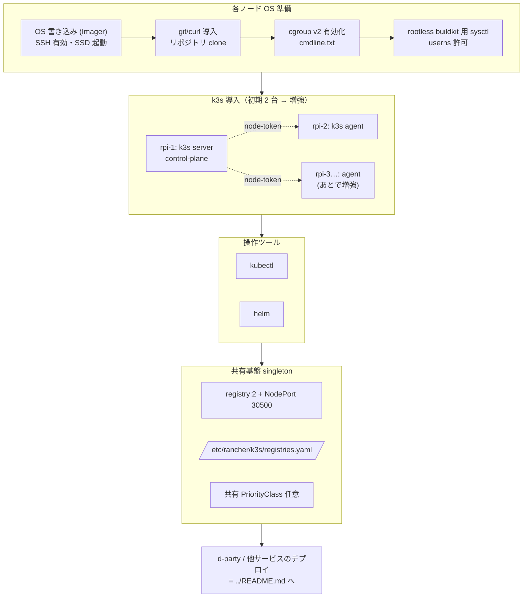

# deploy/platform/CLUSTER-BOOTSTRAP.md — k3s クラスタ立ち上げ手順書

Raspberry Pi（arm64）で **k3s クラスタをゼロから立ち上げ**、d-party を含む複数サービスが
同居できる状態にするまでの手順書です。**ノード OS の準備 → k3s 導入 → 操作ツール →
共有基盤の適用**までを 1 本に通します。

> 🟢 **本書の初期構成: 2 台（control-plane 1 + worker 1）で立ち上げ、後からノードを増強**します。
> 将来 worker を追加する手順は [§3.4 ノード増強](#34-ノード増強後から-worker-を足す)。
> まず動かしたい人は **[§9 ゼロから 2 台を立てる最短コマンド列](#9-付録-ゼロから-2-台を立てる最短コマンド列)** だけ追えば一通り通ります。

このドキュメントの守備範囲（と、しないこと）:

- ✅ **対象**: クラスタ基盤そのもの（k3s server/agent、ノード OS 設定、kubectl/helm、
  共有ローカルレジストリ）。これらは d-party 専用ではなく、**同居する全サービスの共通基盤**です。
- ❌ **対象外（=他ドキュメント）**:
  - d-party アプリ本体のデプロイ・グレースフル更新・Argo CD/Cloudflare 検証 →
    [`../README.md`](../README.md)
  - 共有レジストリ singleton の意図と詳細 → [`README.md`](README.md)
  - cloudflared 本体・ドメイン割り当て・Argo CD 本体の常駐 → **別の「クラスタ運用リポジトリ」**
    （マルチテナント基盤なので d-party リポジトリの所有物ではない）

> ⚠️ **マルチサービス前提**: このクラスタには d-party 以外のサービスも同居します。
> 本書で作るもの（k3s・レジストリ・PriorityClass 等）は **クラスタに 1 回だけ**適用する
> 共有資産です。サービスごとに作り直さないこと。理想は本書一式を別の platform リポジトリへ
> 切り出すことです（[`README.md` 「理想形」](README.md) 参照）。

---

## 0. 全体像



所要のノード台数: **初期は control-plane 1 + worker 1 = 2 台**で立ち上げ、負荷に応じて
worker を増強します（[§3.4](#34-ノード増強後から-worker-を足す)）。以降コマンド中のホスト名は
`rpi-1`(server) / `rpi-2`(agent)、増強分を `rpi-3…` と表記します。

> **2 台構成の注意**: control-plane も Pod を動かせる（k3s の server は既定で schedulable）ので、
> 2 台でも d-party 一式（nginx/django/frontend/postgres/redis）は載ります。冗長性は低い構成
> なので、本番可用性が要るなら worker 増強と各 `replicaCount` 引き上げを検討してください
> （ただし **django は replicas=1 固定**。理由は [`../README.md` §2](../README.md)）。

---

## 1. ハードウェア / OS の準備（電源も入れていない Pi から）

| 項目 | 推奨 |
|---|---|
| ノード | Raspberry Pi 4B（4GB 以上、できれば 8GB）×2 から開始（後で増強） |
| ストレージ | **USB3 接続 SSD**（microSD は PostgreSQL の書き込みで寿命が尽きるため非推奨） |
| OS | Raspberry Pi OS Lite (64-bit) もしくは Ubuntu Server 24.04 (arm64) |
| ネットワーク | 全ノード同一 LAN・固定 IP 推奨（DHCP 予約でも可） |

> このクラスタには **何のツールも入っていない前提**で進めます（git も docker も kubectl も
> 無い）。必要なものは各節でその都度インストールします。

### 1.1 OS イメージの書き込み（手元の PC で）

[Raspberry Pi Imager](https://www.raspberrypi.com/software/) を手元の PC（Mac/Windows/Linux）に入れ、
各ノードのストレージ（**SSD 推奨**）へ OS を書き込みます。Imager の **歯車（詳細設定）** で
ヘッドレス初期設定まで済ませるのが最短です:

- OS: `Raspberry Pi OS Lite (64-bit)`（または Ubuntu Server 24.04 arm64）
- **ホスト名**: `rpi-1` / `rpi-2`（ノードごとに変える）
- **SSH を有効化**（公開鍵を登録すると以降パスワード不要）
- **ユーザ名 / パスワード**を設定（例: `pi`）
- Wi-Fi よりも **有線 LAN 推奨**（クラスタ内通信が安定）

> **SSD から起動**: Pi 4B は USB ブート対応。SSD を USB3 に挿し Imager で SSD に焼けば
> そのまま USB 起動します（microSD は使わない）。古いファームの個体は一度 microSD で起動して
> `sudo rpi-eeprom-update -a` → 再起動でブートローダを更新してください。

書き込んだストレージを Pi に挿し、有線 LAN・電源を接続して起動します。

### 1.2 各ノードへ SSH して共通初期設定

ルータの管理画面か `ping rpi-1.local`（mDNS）で IP を確認し、手元から SSH します。

```bash
ssh pi@rpi-1.local     # または ssh pi@<rpi-1 の IP>
```

各ノード（rpi-1, rpi-2）で、k3s を入れる前の共通初期設定を行います。
**ここで git / curl など以降で使うツールをまとめて入れます**。

```bash
# ホスト名（Imager で設定済みなら不要。違えばここで合わせる）
sudo hostnamectl set-hostname rpi-1     # ノードごとに rpi-1 / rpi-2

# パッケージ更新 + 以降で使う基本ツール（git・curl・ssh は最低限）
sudo apt-get update && sudo apt-get -y upgrade
sudo apt-get install -y git curl ca-certificates openssh-server

sudo timedatectl set-timezone Asia/Tokyo
```

### 1.3 リポジトリの取得（kubectl apply の元ファイル）

§5 以降で `kubectl apply -f deploy/platform/...` を使うため、**そのコマンドを打つマシン**
（rpi-1 か、手元の開発機）にこのリポジトリを clone しておきます。

```bash
git clone https://github.com/d-party/d-party.git
cd d-party
# 共有基盤の yaml はサブモジュール不要（registry.yaml 等はルート管理）。
# d-party アプリのビルド（../README.md §3.2）まで進む場合のみ submodule を取得:
#   git submodule update --init --recursive
```

> 外向きポート開放は不要です。公開は Cloudflare Tunnel（cloudflared）が *outbound* で
> 張るため、ルータのポートフォワード・固定グローバル IP は要りません（[`../README.md` §1](../README.md)）。

---

## 2. ノード OS の事前設定（k3s 導入前に全ノード）

### 2.1 cgroup v2（メモリ制御を効かせる）

Raspberry Pi のブートでは cgroup memory が既定で無効なことがあります。Pod の
`resources.limits` を効かせるため有効化します。

```bash
# Raspberry Pi OS の場合: /boot/firmware/cmdline.txt（または /boot/cmdline.txt）の
# 既存 1 行の末尾へ追記（改行を入れない）
#   ... cgroup_enable=memory cgroup_memory=1
sudo sed -i 's/$/ cgroup_enable=memory cgroup_memory=1/' /boot/firmware/cmdline.txt

# 反映には再起動が必要
sudo reboot

# 再起動後に確認（memory が出れば OK）
cat /sys/fs/cgroup/cgroup.controllers
```

> Ubuntu Server (arm64) は cgroup v2 が既定有効なので通常この手順は不要です。

### 2.2 rootless BuildKit 用の userns 許可（ビルドを走らせるノードのみ）

クラスタ内ビルド（[`../build/`](../build)）は **rootless BuildKit** で user namespace を使います。
ビルド Job をスケジュールするノードで以下を有効化します。

```bash
# Ubuntu 24.04 (arm64) で必要になりやすい
sudo sysctl -w kernel.apparmor_restrict_unprivileged_userns=0
sudo sysctl -w user.max_user_namespaces=28633   # 値が 0 の場合のみ

# 恒久化
echo 'kernel.apparmor_restrict_unprivileged_userns=0' | sudo tee /etc/sysctl.d/99-buildkit.conf
echo 'user.max_user_namespaces=28633' | sudo tee -a /etc/sysctl.d/99-buildkit.conf
```

> Raspberry Pi OS では既定で利用可能なことが多く、不要な場合があります。
> ビルドをしない（外部レジストリの既製イメージを使う）運用なら 2.2 はスキップ可。

---

## 3. k3s の導入

### 3.1 control-plane（rpi-1, 1 台目）

```bash
# server を導入。
# --write-kubeconfig-mode 644 : 後で一般ユーザ / 手元へ kubeconfig をコピーしやすくする
# --disable traefik           : 公開は cloudflared が担うため Traefik は使わない（任意）
curl -sfL https://get.k3s.io | sh -s - server \
  --write-kubeconfig-mode 644 \
  --disable traefik

# 起動確認
sudo systemctl status k3s --no-pager
sudo k3s kubectl get nodes
```

agent を参加させるために **join token** と **server URL** を控えます。

```bash
# join token（agent 側で使う）
sudo cat /var/lib/rancher/k3s/server/node-token

# server URL は https://<rpi-1 の IP>:6443
hostname -I | awk '{print $1}'
```

> **NetworkPolicy について**: 本 chart は postgres/redis を NetworkPolicy で同 release 内に
> 隔離します（[`../helm/d-party/values.yaml` networkPolicy](../helm/d-party/values.yaml)）。
> k3s v1.21+ は kube-router ベースの NetworkPolicy controller を内蔵しているので既定で有効です。
> `--disable-network-policy` は **付けないでください**（付けると DB/Redis の隔離が無効化されます）。

### 3.2 worker / agent（rpi-2）

agent ノード（初期は rpi-2 の 1 台）で、3.1 で控えた値を使って参加させます。

```bash
# 環境変数で server URL と token を渡す
export K3S_URL="https://<rpi-1 の IP>:6443"
export K3S_TOKEN="<node-token の中身>"

curl -sfL https://get.k3s.io | sh -s - agent

# agent サービスとして起動する
sudo systemctl status k3s-agent --no-pager
```

### 3.3 クラスタ確認（rpi-1 で）

```bash
sudo k3s kubectl get nodes -o wide
# rpi-1 (control-plane,master) / rpi-2 の 2 台が Ready になれば初期構成は成功
```

> worker に `Ready` 表示までは数十秒かかることがあります。`STATUS` が `NotReady` のままなら
> agent 側で `sudo journalctl -u k3s-agent -f` を確認。token / URL の誤りが大半です。

### 3.4 ノード増強（後から worker を足す）

負荷が上がったら worker を足すだけで水平に増やせます。**control-plane の再構築は不要**で、
新ノードを agent として参加させるだけです。

```bash
# 新ノード（rpi-3 …）で OS 準備（§1, §2）を済ませてから:
export K3S_URL="https://<rpi-1 の IP>:6443"
export K3S_TOKEN="<rpi-1 の /var/lib/rancher/k3s/server/node-token>"
curl -sfL https://get.k3s.io | sh -s - agent

# rpi-1 / 手元で増えたことを確認
kubectl get nodes -o wide
```

増強後にやること（任意）:

- 新ノードにも **`registries.yaml` を配置**（[§5.2](#52-各ノードの-containerd-ミラー設定)）。
  忘れるとそのノードの Pod だけ `ImagePullBackOff` になります。
- ビルドを新ノードで走らせるなら **userns sysctl**（[§2.2](#22-rootless-buildkit-用の-userns-許可ビルドを走らせるノードのみ)）。
- 可用性を上げるなら nginx/frontend の `replicaCount` を増やし、`podAntiAffinity` で
  ノード分散（**django は replicas=1 のまま**）。

> control-plane を冗長化（HA, server 複数）したくなった場合は k3s embedded etcd 構成への
> 移行が必要です（`--cluster-init`）。2 台→数台の増強段階では通常そこまで不要です。

---

## 4. 操作ツール（kubectl / helm）

手元の開発機（この dev container でも可）からクラスタを操作できるようにします。

### 4.1 kubeconfig を手元へ

```bash
# rpi-1 の /etc/rancher/k3s/k3s.yaml を手元にコピーし、server を rpi-1 の IP に書き換える
scp <user>@<rpi-1 の IP>:/etc/rancher/k3s/k3s.yaml ~/.kube/d-party-config
sed -i 's#https://127.0.0.1:6443#https://<rpi-1 の IP>:6443#' ~/.kube/d-party-config
export KUBECONFIG=~/.kube/d-party-config

kubectl get nodes      # 手元から見えれば成功
```

### 4.2 kubectl / helm のインストール（手元に無ければ）

```bash
# kubectl（arm64/amd64 は uname に追従）
curl -LO "https://dl.k8s.io/release/$(curl -L -s https://dl.k8s.io/release/stable.txt)/bin/linux/$(dpkg --print-architecture)/kubectl"
sudo install -m 0755 kubectl /usr/local/bin/kubectl

# helm
curl -fsSL https://raw.githubusercontent.com/helm/helm/main/scripts/get-helm-3 | bash

kubectl version --client
helm version
```

> この dev container には `kubectl` / `helm` / `k3d` / `cloudflared` 等が devcontainer
> features で同梱されています（[`/.devcontainer/devcontainer.json`](../../.devcontainer/devcontainer.json)）。
> 手元検証だけなら実機 k3s の代わりに k3d でも可（[`../README.md` §5.2](../README.md)）。

---

## 5. 共有基盤の適用（クラスタに 1 回だけ）

ここからは **クラスタ全体で共有する singleton** です。意図の詳細は [`README.md`](README.md)。

### 5.1 ローカルレジストリ

```bash
# registry:2 + Namespace(registry) + ClusterIP + NodePort(30500) を作成
kubectl apply -f deploy/platform/registry.yaml
kubectl -n registry rollout status deploy/registry
```

### 5.2 各ノードの containerd ミラー設定

各ノードの containerd が `registry.registry.svc.cluster.local:5000/...` を NodePort 経由で
pull できるようにします。**全ノードに配置 → k3s 再起動**が必要です。

```bash
# 全ノード（server / agent とも）で実施
sudo cp deploy/platform/k3s-registries.yaml /etc/rancher/k3s/registries.yaml

# server ノード
sudo systemctl restart k3s
# agent ノード
sudo systemctl restart k3s-agent
```

> 配置漏れのノードがあると、そのノードに乗った Pod だけ `ImagePullBackOff` になります。
> `kubectl get pods -o wide` で落ちている Pod のノードを特定し、5.2 を再実施してください。

### 5.3 （任意）共有 PriorityClass

複数サービスが同居するクラスタでは、PriorityClass はクラスタ共有が望ましいです。
共有 PriorityClass を先に作っておき、各 chart はそれを参照する（生成しない）構成にできます。

```bash
# 共有 PriorityClass を一度だけ作る例
kubectl apply -f - <<'EOF'
apiVersion: scheduling.k8s.io/v1
kind: PriorityClass
metadata: { name: cluster-stateful }
value: 100000
description: "DB/Redis 等 stateful を優先して残す（メモリ逼迫時に evict されにくく）"
---
apiVersion: scheduling.k8s.io/v1
kind: PriorityClass
metadata: { name: cluster-app }
value: 10000
description: "stateless アプリ用（stateful より低い）"
EOF
```

この場合、d-party chart 側は `priorityClass.create=false` にして既存名を参照します:

```bash
helm ... \
  --set priorityClass.create=false \
  --set priorityClass.stateful.name=cluster-stateful \
  --set priorityClass.app.name=cluster-app
```

> chart 既定（`priorityClass.create=true`）のままだと d-party 専用の PriorityClass を
> 自前生成します。単独運用ならそれでも動きますが、**多サービス同居では共有名に寄せる**のが整います
> （[`../helm/d-party/values.yaml` priorityClass](../helm/d-party/values.yaml)）。

---

## 6. ここまでの到達点と次のステップ

この時点でクラスタは「サービスを載せられる空の基盤」です。**d-party 自体のデプロイ**
（イメージビルド・Secret・helm/Argo CD・グレースフル更新・Cloudflare 公開）は
[`../README.md`](../README.md) に続きます。流れの対応:

| やること | ドキュメント |
|---|---|
| backend/frontend をクラスタ内ビルド → 共有レジストリへ push | [`../README.md` §3.2](../README.md) / [`../build/`](../build) |
| 機微情報（`SECRET_KEY` / `POSTGRES_PASSWORD`）を Secret 化 | [`../README.md` §3.1](../README.md)（SealedSecrets/SOPS） |
| helm で d-party をデプロイ | [`../README.md` §3.4](../README.md) |
| Argo CD で GitOps 化 | [`../README.md` §3.3 / §6](../README.md) |
| cloudflared で外部公開 | [`../README.md` §5](../README.md)（Quick Tunnel 検証含む） |

---

## 7. クラスタ健全性チェックリスト

基盤が正しく立ったかの最終確認:

```bash
# 全ノード Ready
kubectl get nodes

# 共有レジストリが Ready / NodePort が開いている
kubectl -n registry get deploy,svc
curl -s http://<任意ノードの IP>:30500/v2/ && echo   # {} が返れば OK

# DNS / システム Pod が正常
kubectl -n kube-system get pods

# NetworkPolicy controller が有効か（k3s 内蔵）— 後で chart の DB 隔離が効く前提
kubectl get networkpolicies -A
```

---

## 8. トラブルシュート

| 事象 | 原因 | 対処 |
|---|---|---|
| Pod の `limits.memory` が効かない / OOM が暴れる | cgroup memory 無効 | §2.1 を実施し再起動。`cat /sys/fs/cgroup/cgroup.controllers` に `memory` が出るか確認 |
| agent が `NotReady` のまま | token / server URL 誤り、ファイアウォール | agent で `journalctl -u k3s-agent -f`。6443 への到達と token を確認 |
| 一部ノードだけ `ImagePullBackOff` | そのノードに `registries.yaml` 未配置 | §5.2 を当該ノードで再実施 → `systemctl restart k3s(-agent)` |
| `curl :30500/v2/` が繋がらない | registry Pod が未 Ready / NodePort 未作成 | `kubectl -n registry get pods,svc`。`registry.yaml` 再 apply |
| rootless BuildKit Job が `operation not permitted` | userns 未許可 | §2.2 の sysctl をビルド先ノードで実施・恒久化 |
| postgres/redis が他 namespace から素通しで届く | NetworkPolicy が無効化されている | k3s 起動オプションに `--disable-network-policy` が無いか確認。chart 側 `networkPolicy.enabled=true` を確認 |
| microSD ですぐ壊れる / DB が遅い | microSD への書き込み寿命 | USB3 SSD に移行（§1） |

---

## 9. 付録: ゼロから 2 台を立てる最短コマンド列

説明を抜いた「写経用」の最短手順です。各コマンドの意図は本文の該当節を参照。
`<RPI1_IP>` は control-plane の IP に読み替えてください。

前提: Raspberry Pi Imager で OS を SSD に焼き、SSH 有効・ホスト名設定済み（[§1.1](#11-os-イメージの書き込み手元の-pc-で)）。

```bash
# ── 全ノードで（rpi-1, rpi-2 とも。手元から ssh して実行） ──────
sudo apt-get update && sudo apt-get -y upgrade
sudo apt-get install -y git curl ca-certificates openssh-server
sudo timedatectl set-timezone Asia/Tokyo
# Raspberry Pi OS のみ: cgroup memory 有効化 → 再起動（Ubuntu は不要）
sudo sed -i 's/$/ cgroup_enable=memory cgroup_memory=1/' /boot/firmware/cmdline.txt
sudo reboot
#  ↑再起動後、ビルドを走らせるノードだけ:
sudo sysctl -w kernel.apparmor_restrict_unprivileged_userns=0
sudo sysctl -w user.max_user_namespaces=28633

# ── kubectl を打つマシン（rpi-1 か手元）でリポジトリ取得 ────────
git clone https://github.com/d-party/d-party.git && cd d-party

# ── rpi-1: control-plane ───────────────────────────────────────
curl -sfL https://get.k3s.io | sh -s - server \
  --write-kubeconfig-mode 644 --disable traefik
sudo cat /var/lib/rancher/k3s/server/node-token     # ← TOKEN を控える
hostname -I | awk '{print $1}'                       # ← <RPI1_IP> を控える

# ── rpi-2: agent ───────────────────────────────────────────────
export K3S_URL="https://<RPI1_IP>:6443"
export K3S_TOKEN="<上で控えた TOKEN>"
curl -sfL https://get.k3s.io | sh -s - agent

# ── 手元 or rpi-1 で確認 ───────────────────────────────────────
kubectl get nodes -o wide        # rpi-1 / rpi-2 が Ready

# ── 共有基盤（クラスタに 1 回） ────────────────────────────────
kubectl apply -f deploy/platform/registry.yaml
kubectl -n registry rollout status deploy/registry
#  全ノードで registries.yaml を配置 → k3s 再起動
sudo cp deploy/platform/k3s-registries.yaml /etc/rancher/k3s/registries.yaml
sudo systemctl restart k3s          # rpi-1
sudo systemctl restart k3s-agent    # rpi-2

# ── ここまでで基盤完成。d-party のデプロイは ../README.md §3 へ ──
```

---

## 付録: ノード初期化（やり直し）

クラスタを作り直したいとき、k3s は同梱のアンインストーラで綺麗に消せます。

```bash
# server ノード
/usr/local/bin/k3s-uninstall.sh
# agent ノード
/usr/local/bin/k3s-agent-uninstall.sh
```
